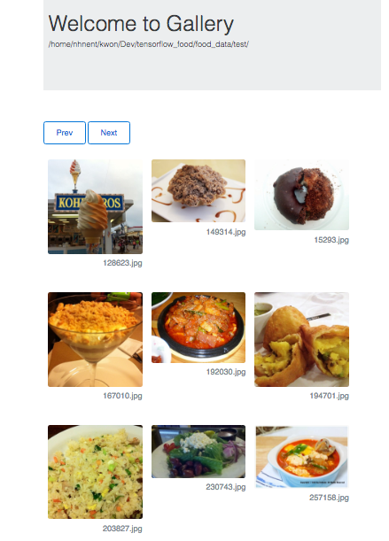
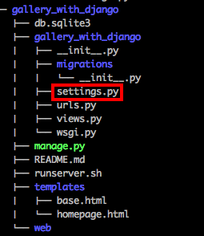
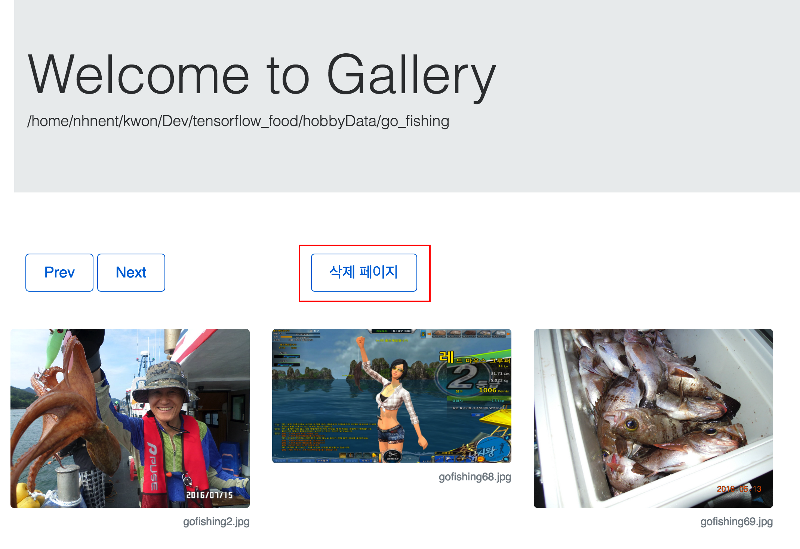
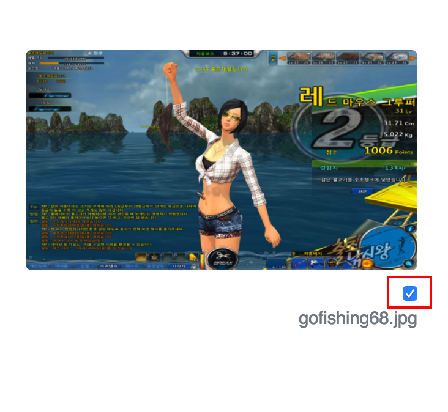
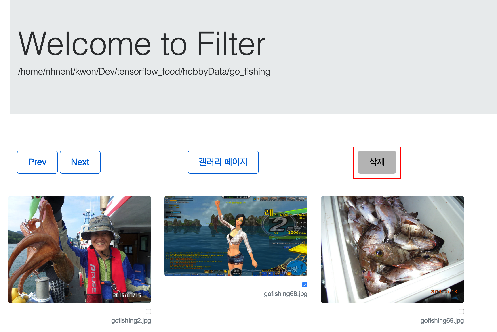
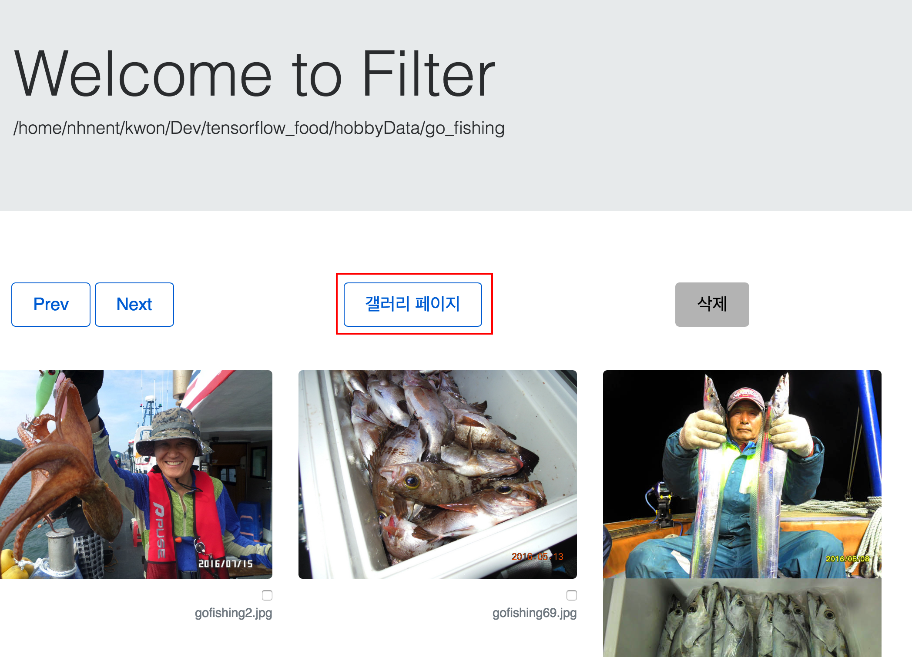

# 갤러리 with Python

이미지 확인을 위한 갤러리 서비스로 지정한 디렉토리의 jpg 이미지 파일을 갤러리 형식으로 확인 할 수 있다

1. [설치](#id-section1)
2. [이미지 디렉토리 지정](#id-section2)
3. [실행](#id-section3)
4. [접속 포트 변경 방법](#id-section4)
5. [이미지 삭제 방법](#id-section5)




## 사용 방법


<div id='id-section1'/>
### 설치
<div id='id-section1'/>

현재 프로젝트를 git을 사용해서 원하는 위치에 checkout 받는다.

```
git clone https://github.nhnent.com/toast-lab/gallery_with_django.git --branch release/0.0.1
```

<div id='id-section2'/>
### 이미지 디렉토리 지정
<div id='id-section2'/>

설치된 파일은 다음과 유사하다. 설치된 디렉토리에서 settings.py 파일의 위치를 확인한다.



편집기를 이용해서 settings.py 파일을 연다.

```
vim gallery_with_django/gallery_with_django/settings.py
```

편집기에서 파일의 마지막으로 이동해서 아래 위치를 확인한다. ( vi 명령어 모드에서 단축키 대문자 G. 즉 shift + g )


IMG_DATA_DIR 변수를 보고 싶은 이미지 파일이 있는 디렉토리 위치로 지정한다. 

```
IMG_DATA_DIR 변수는 request를 처리하는 부분에서도 사용하고 있기 때문에 변수 이름을 변경하면 안된다
```

프로그램 실행 중, IMG_DATA_DIR 경로가 편집에 의해 바뀌어도 자동으로 반영되기 때문에 **재실행이 필요 없다**.

<div id='id-section3'/>
### 실행
<div id='id-section3'/>

Django가 설치되어 있지 않거나 버전이 낮은 경우 다음과 같이 실행한다.

```
pip install --upgrade django
```

다음과 같이 runserver.sh를 사용해 프로그램을 백그라운드로 실행한다.

```
nohup ./runserver.sh &
```

로그는 프로그램을 실행한 디렉토리의 nohup.out에서 확인할 수 있다.

<div id='id-section4'/>
### 접속 포트 변경 방법
<div id='id-section4'/>

여러명의 사람이 사용할 경우, 포트 충돌이 발생할 수 있으므로 runserver.sh를 편집해 포트를 변경할 수 있다. 
다음은 예제는 포트가 8001로 지정된 것을 나타낸다. 

```
#!/usr/bin/env bash

python ./manage.py runserver 0.0.0.0:8001
```

<div id='id-section5'/>
### 이미지 삭제 방법
<div id='id-section5'/>

갤러리 페이지에서 아래와 같이 **삭제 페이지** 버튼을 클릭해서 이동한다 



삭제 하고 싶은 파일의 checkbox를 누른다. 다수의 이미지 선택 가능하다.



상단과 하단에 있는 삭제 버튼을 클릭하면 선택된 이미지가 서버에서 삭제된다



**갤러리 페이지** 버튼을 클릭하면 갤러리 페이지로 이동한다



### TODO 
* 계층 구조: 현재는 하위 디렉토리 이미지도 보여 줄 수 있는 기능
